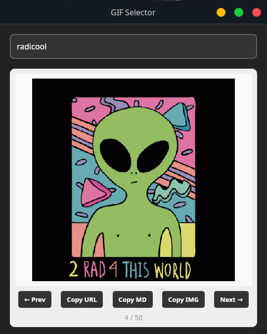

# insertgif

Simple Linux GUI for searching and copying GIF URLs from [KLIPY](https://klipy.com).



## Features

- Search GIFs via the KLIPY API
- Navigate with arrow keys or Tab
- Copy URL, Markdown, or HTML to clipboard
- Keyboard shortcuts:
  - `Enter` - Search
  - `←/→` or `Tab/Shift+Tab` - Navigate
  - `Shift+Enter` - Copy URL
  - `Esc` - Close window

## Configuration

Get a KLIPY API key from the [Partner Panel](https://klipy.com/developers), then
make it available one of two ways:

```bash
# Option A: environment variable
export KLIPY_API_KEY=your_key_here

# Option B: config file (preferred for the desktop launcher, which doesn't
# inherit your shell env)
mkdir -p ~/.config/insertgif
echo 'KLIPY_API_KEY=your_key_here' > ~/.config/insertgif/env
```

The env var takes precedence over the config file. The test key allows 100
req/min; production throughput needs approval via the Partner Panel.

## Build

Requires Rust and system dependencies:

```bash
# Install Rust
curl --proto '=https' --tlsv1.2 -sSf https://sh.rustup.rs | sh

# Install dependencies (Debian/Ubuntu)
sudo apt install libwebkit2gtk-4.1-dev \
  build-essential \
  curl \
  wget \
  file \
  libssl-dev \
  libayatana-appindicator3-dev \
  librsvg2-dev \
  libsoup-3.0-dev \
  libgtk-3-dev \
  libglib2.0-dev \
  pkg-config

# Build
cd ~/Documents/code/insertgif/src-tauri
cargo build --release

# Binary location
./target/release/insertgif
```

## Dev Mode

```bash
cd ~/Documents/code/insertgif/src-tauri
cargo run
```

## Icon

Place a `icon.png` in `src-tauri/icons/` (recommended 512x512px).
